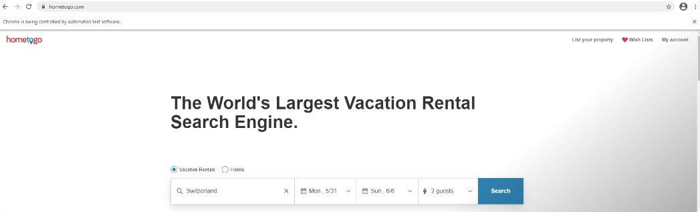
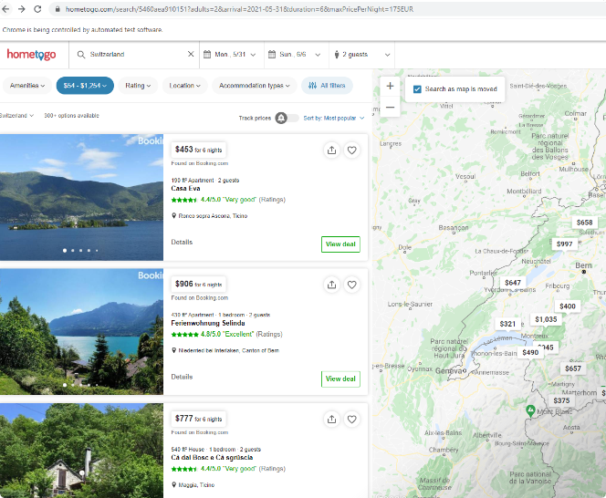
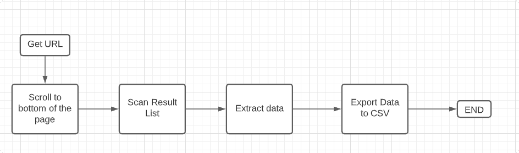
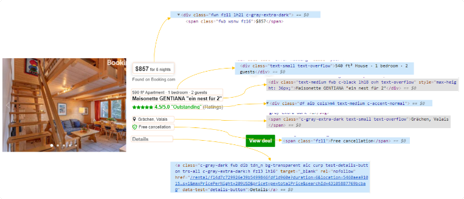

# Web_Scraping
Tipología y ciclo de vida de los datos

# Web-Scraping

## ***Descripción del proyecto***

Como consecuencia de la pandemia, los dos miembros de este equipo coincidimos en nuestras ganas de poder volver a viajar de nuevo. Por ello, y buscando una idea que podamos reutilizar en el futuro, nos hemos propuesto enfocar esta práctica en la obtención de los mejores resultados de alquileres turísticos en distintas zonas, con el fin de poder conseguir buenos tratos en cuanto por fin, podamos salir de viaje.

Concretamente vamos a analizar y scrapear la web de alquileres https://www.hometogo.com, por tratarse de un agregador de alquileres con información de airbnb, booking, entre muchas otras... Como suele decirse, quien scrapea a un scrapeador, tiene 100 años de perdón; así que esperamos que este proyecto sea de mucha utilidad (sobre todo, porque ello significará que la pandemia nos da un respiro!)

Un buen viajero no tiene planes fijos ni tampoco la intención de llegar, pero es necesario un lugar donde dormir!

## ***Procedimiento***

### User Experience ###

Lo primero que miramos es la experiencia de usuario al entrar en https://www.hometogo.com para tener claro qué queremos extraer y cómo.
Como usuario, cuando entro en hometogo, lo primero que hago es seleccionar:

- Destino
- Fechas
- Nº de personas
- Le damos a search

Al hacer la búsqueda nos aparece un listado de resultados:

Estos son los resultados que nos interesa extraer para poder recopilar los resultados y elegir el destino con el mejor precio para poder disfrutar de nuestras vacaciones.

Una vez tenemos clara la experiencia de usuario que queremos replicar con el web scraping, podemos pasar a definir cuál es el process map que mejor representa dicha experiencia.

### Process Map ###

En este proyecto nos quedaremos solo con los resultados de la primera página, ya que en una única página hay aproximadamente 280 resultados, y son suficientes para el trabajo que queremos hacer.

### Inspeccionar elementos de la página de resultados ###
#### ¿Cuál es la información que nos interesa extraer? ####

1) Nombre del alojamiento
2) Precio del alojamiento
3) Localización del alojamiento
4) Rating del alojamiento
5) Aspectos Importantes (Por ejemplo política de cancelación)
6) Especificaciones del alojamiento
7) Link a más detalles

